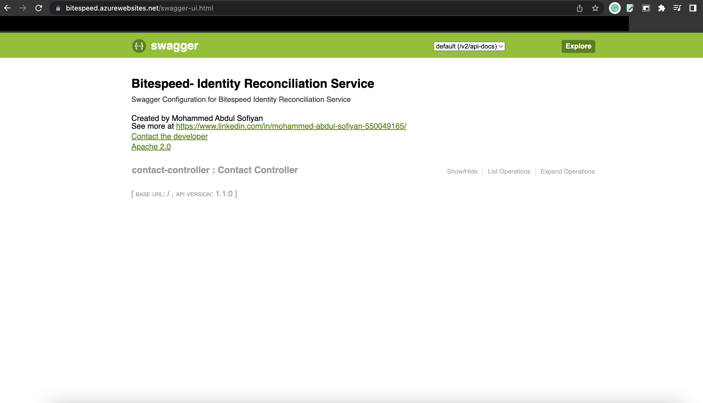
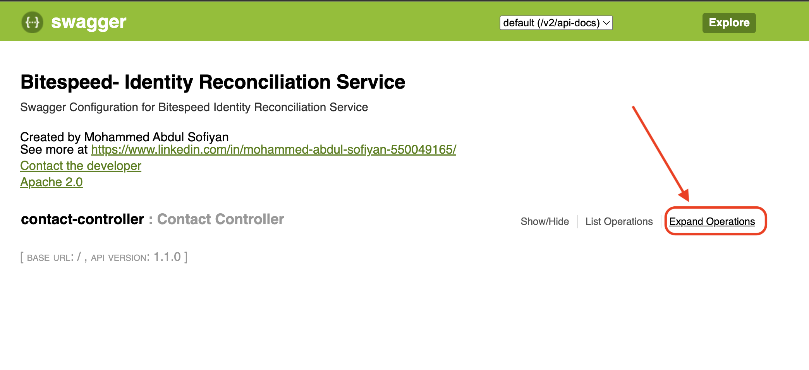
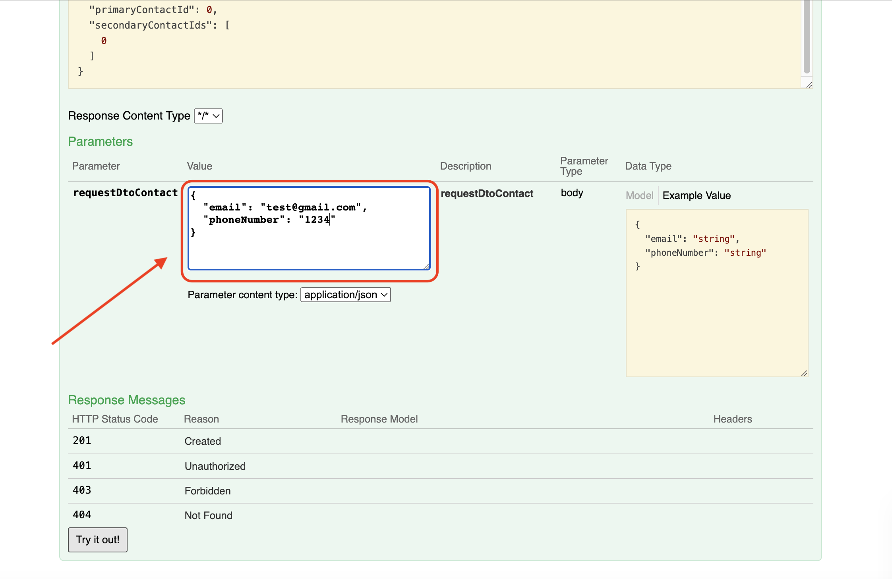
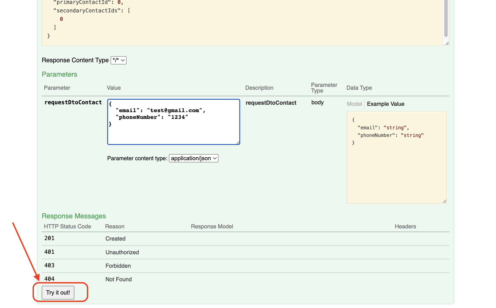
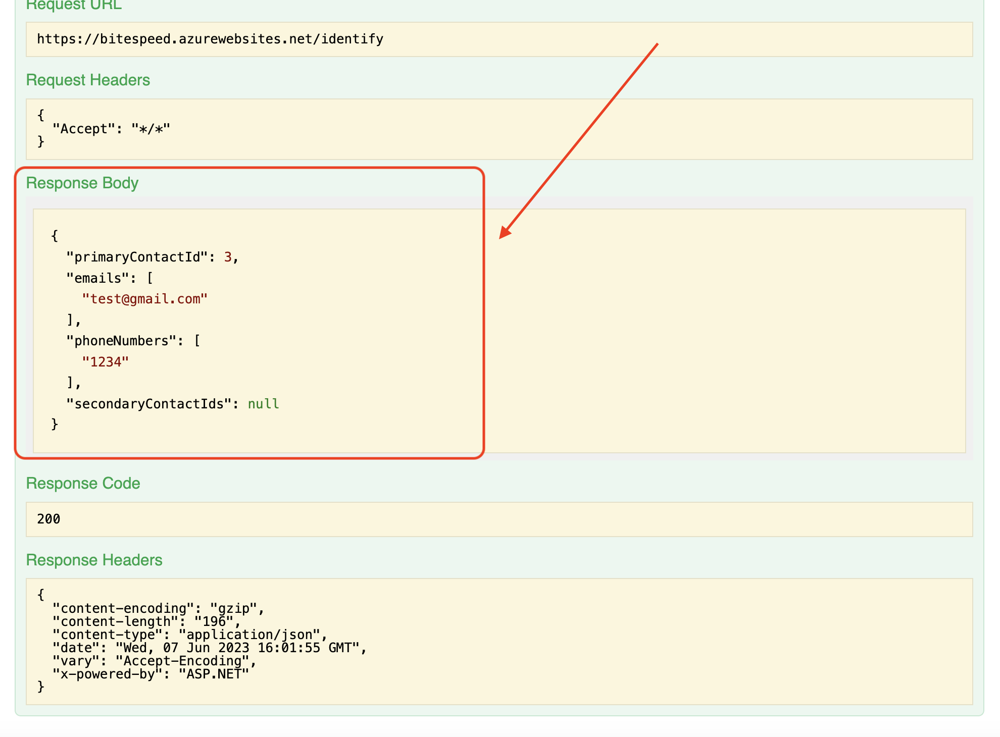

Bitespeed Backend Task: Identity Reconciliation
===

## About Myself
- Name: <b>Mohammed Abdul Sofiyan</b>
- My Resume: [View/Download](https://drive.google.com/file/d/1Ha9q2wrMe0n6TgKzGx8-YluJvi8qvNLH/view?usp=sharing)
- My LinkedIn Profile: [view](https://www.linkedin.com/in/mohammed-abdul-sofiyan-550049165/)
- GeeksForGeeks Profile: [view](https://auth.geeksforgeeks.org/user/sufiyan0211/practice)
- Email Address: `sufiyan0211@gmail.com`

## About Task(Identity Reconciliation Service)

### Some Usefull Links:
- Host/live: [bitespeed.azurewebsites.net](https://bitespeed.azurewebsites.net/swagger-ui.html)
- Requirements Documentation: [view](https://bitespeed.notion.site/Bitespeed-Backend-Task-Identity-Reconciliation-53392ab01fe149fab989422300423199)
- Test Cases docs
  - Case1: [view](https://docs.google.com/document/d/1fyk-jZwG_mAPp28Ht4dMgsB9HNeh1IiM8xx31fVlSj4/edit?usp=sharing)
  - Case2: [view](https://docs.google.com/document/d/15tFjnLTNlaMFp49ZFhzwJfZ-Q6m1K9PtDlIByDKwgkw/edit?usp=sharing)
  - Case3: [view](https://docs.google.com/document/d/1NXa0f2NO6KsFVbyQHO8YJrVqJwsuINTbeaOmh9WhrpA/edit?usp=sharing)

### Instructions to use
- step1: Go to hosted [website](https://bitespeed.azurewebsites.net/swagger-ui.html)
- 
- step2: click on Expand Operations
- 
- step3: Enter payload(email or phoneNumber)
- 
- step4: click on `Try it out!`
- 
- step5: View response at `Response Body` section
- 